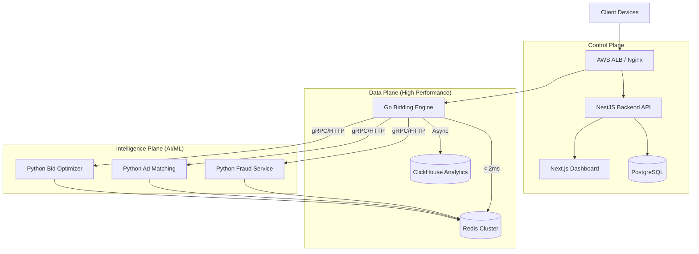

# TaskirX Architecture
## Polyglot High-Performance Ad Exchange System

**Version:** 3.0
**Last Updated:** February 10, 2026
**Target Scale:** 100K+ requests/second, <20ms latency

---

## 🎯 Architecture Overview



---

## 📊 Technology Stack

### **Core Technologies**

| Layer | Technology | Why? |
|-------|-----------|------|
| **Runtime** | Node.js 20+ | Fast server-side execution for Management API |
| **Backend Framework** | NestJS | Enterprise-grade architecture, Modules, Dependency Injection |
| **Bidding Engine** | Go (Golang) | Ultra-low latency, high concurrency for RTB |
| **AI Agents** | Python (FastAPI) | Extensive ML ecosystem (Scikit-learn, Pandas) |
| **Language** | TypeScript | Type safety, better IDE support, maintainability |
| **Frontend** | Next.js / React | Real-time Dashboard with WebSockets |
| **Backend API** | NestJS | Robust, typed business logic and management layer |
| **Bidding Engine** | Go (Golang) | Ultra-low latency execution (<20ms) |
| **Primary DB** | PostgreSQL | Reliability, ACID transactions, relational data |
| **Analytics DB** | ClickHouse | Real-time column-oriented OLAP for billions of rows |
| **Cache** | Redis 7+ | Hot data, session storage, rate limiting |
| **AI/ML** | Python (FastAPI) | Matching, Optimization, Fraud |

### **Why Polyglot Microservices?**

**Current Scale: 100K+ QPS → Specialized Tools Required**

- ✅ **Go**: Handles the massive throughput of RTB auctions.
- ✅ **Python**: Leverages the rich ecosystem for ML/AI (Scikit, NumPy).
- ✅ **NestJS**: Provides structure and maintainability for complex business rules.
- ✅ **ClickHouse**: Ingests high-velocity event streams for real-time reporting.

---

## 🏗️ Project Structure

```
TaskirX/
├── go-bidding-engine/       # High-performance RTB Service (Ports 8080)
│   ├── cmd/server/          # Entry point
│   ├── internal/service/    # Bidding Logic
│   └── internal/cache/      # Redis handling
│
├── nestjs-backend/          # API Gateway & Management (Port 3000)
│   ├── src/modules/         # Campaigns, Users, Auth
│   └── src/gateways/        # WebSocket Gateway
│
├── python-ai-agents/        # Intelligent Services
│   ├── ad-matching-service/ # Port 8000/6002
│   ├── bid-optimization/    # Port 6003
│   └── fraud-detection/     # Port 6001
│
├── next-dashboard/          # React Dashboard (Port 3001)
├── k8s/                     # Kubernetes Manifests
└── docker-compose.yml       # Local Orchestration
```

---

## 🔄 Request Flow

### **RTB Bid Request (Critical Path - <100ms)**

```
1. Load Balancer
   ↓ (2ms)
2. Express.js Server
   ↓ (5ms)
3. Redis Cache Lookup (Campaign Eligibility)
   ↓ (1ms)
4. Bidding Engine (Auction Algorithm)
   ↓ (10ms)
5. MongoDB Write (Bid Record - Async)
   ↓ (2ms)
6. Response Generation
   ↓ (2ms)
Total: ~22ms (Target: <100ms)
```

### **Campaign Management (No SLA)**

```
1. Load Balancer
   ↓
2. Express.js Server
   ↓
3. JWT Authentication
   ↓
4. Request Validation
   ↓
5. MongoDB Read/Write
   ↓
6. Redis Cache Invalidation
   ↓
7. Response
Total: ~100-500ms (Acceptable)
```

---

## 💾 Database Design

### **MongoDB Collections**

#### **users**
```javascript
{
  _id: ObjectId,
  email: String (indexed, unique),
  password: String (hashed),
  role: String, // advertiser, publisher, admin
  balance: Number,
  apiKey: String (indexed, unique),
  status: String, // active, suspended, pending
  createdAt: Date,
  updatedAt: Date
}
```

#### **campaigns**
```javascript
{
  _id: ObjectId,
  userId: ObjectId (indexed),
  name: String,
  status: String (indexed), // draft, active, paused
  budget: {
    total: Number,
    daily: Number,
    spent: Number
  },
  bidding: {
    strategy: String, // cpm, cpc, cpa, dynamic
    maxBid: Number,
    minBid: Number
  },
  targeting: {
    geo: { countries: [String], cities: [String] },
    device: { types: [String], os: [String] },
    demographics: { age: {min, max}, gender: [String] }
  },
  creative: {
    type: String, // banner, video, native
    sizes: [String], // "300x250", "728x90"
    assets: [{url, type, size}]
  },
  schedule: {
    startDate: Date (indexed),
    endDate: Date (indexed)
  },
  performance: {
    impressions: Number,
    clicks: Number,
    conversions: Number,
    ctr: Number
  }
}

// Compound Indexes
db.campaigns.createIndex({ userId: 1, status: 1 })
db.campaigns.createIndex({ status: 1, "schedule.startDate": 1, "schedule.endDate": 1 })
db.campaigns.createIndex({ "targeting.geo.countries": 1, status: 1 })
```

#### **bids**
```javascript
{
  _id: ObjectId,
  requestId: String (indexed, unique),
  campaignId: ObjectId (indexed),
  userId: ObjectId (indexed),
  bidAmount: Number,
  status: String, // won, lost, timeout
  impressionData: {
    size: String,
    domain: String,
    geo: { country, city, region },
    deviceType: String
  },
  auctionData: {
    floorPrice: Number,
    winningBid: Number,
    totalBids: Number,
    auctionTime: Number // milliseconds
  },
  won: Boolean (indexed),
  servedAt: Date,
  clickedAt: Date,
  createdAt: Date (TTL index: 90 days)
}

// Compound Indexes
db.bids.createIndex({ campaignId: 1, createdAt: -1 })
db.bids.createIndex({ won: 1, servedAt: 1 })
db.bids.createIndex({ createdAt: 1 }, { expireAfterSeconds: 7776000 }) // 90 days TTL
```

---

## 🚀 Redis Caching Strategy

### **Cache Keys & TTLs**

```javascript
// Campaign Eligibility (Hot Path)
campaigns:active:{geoHash}         // TTL: 60s
campaigns:targeting:{campaignId}   // TTL: 300s

// User Data
user:{userId}:profile              // TTL: 600s
user:{userId}:balance              // TTL: 10s

// Geo Targeting
geo:country:{countryCode}          // TTL: 3600s

// Rate Limiting
ratelimit:ip:{ipAddress}           // TTL: 60s
ratelimit:user:{userId}            // TTL: 60s

// Daily Budget Tracking
budget:daily:{campaignId}:{date}   // TTL: 86400s (24h)
```

### **Cache Warming Strategy**

```javascript
// On application start
1. Load all active campaigns → Redis
2. Load geo targeting rules → Redis
3. Precompute campaign eligibility by geo → Redis

// On campaign update
1. Invalidate specific campaign cache
2. Invalidate geo-based eligibility cache
3. Async recompute and cache

// Periodic refresh (every 60s)
1. Refresh active campaigns
2. Update budget spent counters
3. Refresh targeting rules
```

---

## ⚡ Performance Targets

| Metric | Target | Current |
|--------|--------|---------|
| **RTB Latency (P95)** | <100ms | TBD |
| **RTB Latency (P99)** | <200ms | TBD |
| **Throughput** | 10K+ req/s | TBD |
| **Cache Hit Rate** | >90% | TBD |
| **Database Connections** | <100 | TBD |
| **Memory Usage** | <2GB | TBD |
| **CPU Usage** | <70% | TBD |

---

## 🔒 Security Features

1. **JWT Authentication** - Token-based auth with expiry
2. **Rate Limiting** - Per IP and per user limits
3. **Helmet.js** - Security headers
4. **Input Validation** - Joi schema validation
5. **SQL Injection** - Mongoose ODM protection
6. **XSS Prevention** - Output sanitization
7. **CORS** - Restricted origins
8. **API Key Rotation** - UUID-based keys

---

## 📈 Scaling Strategy

### **Horizontal Scaling (Current Focus)**

```
┌─────────────────────────────────────────────┐
│          Load Balancer (NGINX)              │
└────┬────────┬────────┬────────┬─────────────┘
     │        │        │        │
┌────▼───┐ ┌──▼───┐ ┌──▼───┐ ┌──▼───┐
│ App 1  │ │ App 2│ │ App 3│ │ App N│
└────────┘ └──────┘ └──────┘ └──────┘
     │        │        │        │
     └────────┴────────┴────────┘
              │
     ┌────────▼────────┐
     │  Redis Cluster  │
     └────────┬────────┘
              │
     ┌────────▼────────┐
     │ MongoDB Replica │
     │      Set        │
     └─────────────────┘
```

### **Database Scaling**

1. **Read Replicas** - Route read queries to replicas
2. **Sharding** - Shard by userId or geo region
3. **Connection Pooling** - Reuse connections (pool size: 50)
4. **Query Optimization** - Compound indexes, projection

### **Redis Scaling**

1. **Redis Cluster** - 6+ nodes with replication
2. **Read Replicas** - Read-heavy workloads
3. **Key Eviction** - LRU policy for memory management

---

## 🔮 Future Enhancements (Phase 2)

1. **Header Bidding** - Prebid.js integration
2. **Kafka Streaming** - Real-time event processing
3. **Machine Learning** - Bid optimization, fraud detection
4. **Microservices** - Go for RTB, Python for analytics
5. **GraphQL API** - Better client flexibility
6. **Real-time Dashboard** - WebSocket updates
7. **Private Marketplaces** - Deal IDs, preferred deals
8. **Supply Path Optimization** - Direct publisher relationships

---

## 📝 Implementation Phases

### **Phase 1: Core Foundation (Week 1-2)**
- ✅ Project setup
- ✅ Database models
- ✅ Basic RTB endpoint
- ✅ Authentication

### **Phase 2: Performance (Week 3-4)**
- Redis caching
- Query optimization
- Load testing
- Monitoring

### **Phase 3: Features (Week 5-6)**
- Advanced targeting
- Analytics dashboard
- Fraud detection
- Admin panel

### **Phase 4: Production (Week 7-8)**
- Security hardening
- Documentation
- Deployment automation
- Monitoring & alerts

---

## 🎯 Success Metrics

- **Functional**: All OpenRTB 2.5 features implemented
- **Performance**: <100ms P95 latency at 10K QPS
- **Reliability**: 99.9% uptime
- **Security**: Zero critical vulnerabilities
- **Cost**: <$500/month for 10M requests

---

**Next Steps:** Start implementation with optimized folder structure and core services.
